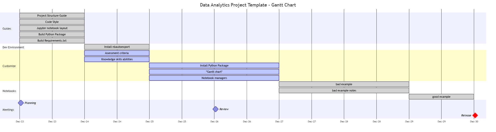
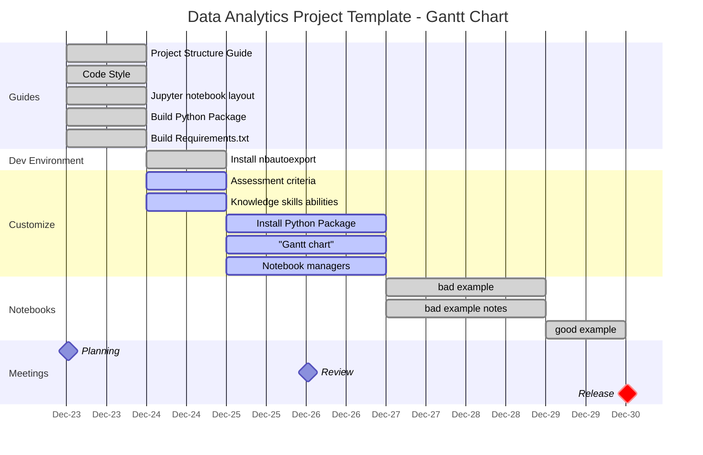

# [Data Analytics Project Template](./../../../)

## Gantt Chart

>"Make a bad plan. Make the best one you can, but don't get obsessive about it. Make a plan, implement it. You'll figure out when you implement it why it's stupid, exactly, and then you can fix it a little bit, and then you can fix it a bit more, and then, eventually, you get a good plan, even if you start with something that's not the best." - [Dr. Jordan B. Peterson, 2018](https://www.jordanbpeterson.com/transcripts/aubrey-marcus/)  

> Gantt chart  

Links made with [Link Shortener Extension](https://timleland.com/link-shortener-extension/)  

Gantt chart made with [Mermaid](https://mermaid-js.github.io/mermaid-live-editor/edit/)  

### Gantt Chart Mermaid Code

---
**Template footnote**  
This project started from the template <https://github.com/markcrowe-com/data-analytics-project-template>. Permission is granted to reproduce for personal and educational use only. Commercial copying, hiring, lending is prohibited. In all cases this notice must remain intact. Author [Mark Crowe](https://github.com/markcrowe-com/) Copyright &copy; 2021, All rights reserved.