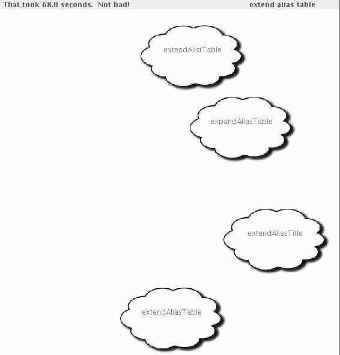
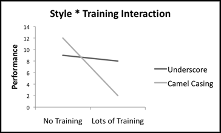


# To CamelCase or Under_score

**Dave Binkley**†, **Marcia Davis**‡, **Dawn Lawrie**†, **Christopher Morrell**†

†Loyola College, Baltimore MD, 21210, USA
‡Johns Hopkins University, Baltimore MD, 21218, USA

binkley@cs.loyola.edu mdavis@csos.jhu.edu lawrie@cs.loyola.edu chm@loyola.edu

## Abstract

*Naming conventions are generally adopted in an effort to improve program comprehension. Two of the most popular conventions are alternatives for composing multi-word identifiers: the use of underscores and the use of camel casing. While most programmers have a personal opinion as to which style is better, empirical study forms a more appropriate basis for choosing between them.*

*The central hypothesis considered herein is that identifier style affects the speed and accuracy of manipulating programs. An empirical study of 135 programmers and non-programmers was conducted to better understand the impact of identifier style on code readability. The experiment builds on past work of others who study how readers of natural language perform such tasks. Results indicate that camel casing leads to higher accuracy among all subjects regardless of training, and those trained in camel casing are able to recognize identifiers in the camel case style faster than identifiers in the underscore style.*

# 1 Introduction

Over the past three decades, the software development process has moved toward greater engineering discipline. Initially this appeared in the form of rules for structuring the control flow of a program. An example is the exclusive use of single exit loops. Over time such rules have been integrated into some programming languages. For instance, in the Java language, the much debated goto statement has been removed. [[5]](#r5) [[18]](#r18) [[16]](#r16) [[10]](#r10) Object-orientation brought similar kinds of rules to the structuring of data. However, language designers have been understandably hesitant to eliminate legacy programming language constructs. This has lead to the introduction of coding standards.[[7]](#r7) [[11]](#r11) [[12]](#r12)

One area where programmers are given considerable syntactic freedom is the construction of identifier names. Excessive liberty in the use of this freedom interferes with source-code understanding, especially when code is transferred from one engineer to another. This has allowed a wide range of proposed conventions and standards for identifier construction.[[4]](#r4) [[3]](#r3) [[19]](#r19)

A recent trend in style guides for identifiers is to favor camel casing (*e.g.*, `spongeBob`) over the use of underscores (*e.g.*, `sponge_bob`). However, natural language research in psychology suggests that this is the wrong choice. For example, a study by Epelboim et al. [[6]](#r6) considered the effect of the type of space filler on word recognition. They found that replacing spaces with Latin letters, Greek letters, or digits had a negative impact on reading. However, shaded boxes have essentially no effect on reading times or on the recognition of individual words. A shaded box depicts a space in a similar way to an underscore. In informal discussions, psychology researchers assert that camel casing should increase reading difficulty.

This suggests that underscores should be preferred over camel casing as an identifier construction style. However, given that camel casing is currently favored in the programming community, perhaps something in the software development process differs from natural language reading. Alternatively, perhaps programmers can be trained to perform with either style. To properly understand the issue and answer these questions requires empirical study of both programmers and non-programmers. The non-programmers provide a control group for studying training. This paper presents results from such a study, which considers the ability to discern closely-related identifier names.

The research presented herein is part of a project aimed at understanding how programmers process the natural-language information held within source code. The goal of this experiment is to better understand the readability of identifiers. The central hypothesis considered is that identifier style (the use of underscores or camel casing) affects the speed and accuracy of manipulating programs. For example, the effect would be negative if long camel-cased identifiers lowered readability by interfering with saccadic identification (eye landings).

The remainder of the paper first presents some necessary background information in Section 2 before describing the experiment's design, the four hypotheses considered, and the results in Sections 3, 4, and 5, respectively. This is followed by a discussion of related work in Section 6. Finally, Section 7 summarizes the paper and suggests future work.

## 2 Background

This section describes three things: first, researchers current understanding of how reading is performed, findings from two prior motivating studies, and finally, the statistical techniques used in the analysis of the empirical data gathered during the study. Current theories of eye movements while reading assert that reading saccades (essentially where the eye lands when one is reading) are programmed primarily on the basis of information about the length of the upcoming word. This is determined by low-level visual processes that detect spaces to the right of fixation point.[[6]](#r6)

In the first study discussed in this section, Epelboim et al. considered the impact of different inter-word fillers on word recognition.[[6]](#r6) Fillers, because they cause *lateral distraction*, have a detrimental effect on reading speed. The study compared reading using four fillers and seven filler placements within English prose. The three combinations of interest are normal (*e.g.*, "sponge bob"), un-spaced (*e.g.*, "spongebob"), and shaded-box filled (*e.g.*, "sponge■bob").

From a visual perspective, the un-spaced text is similar to camel casing except that camel casing might be expected to be easier to read because of the added clues provided by capitalization to aid in fixation. The use of a shaded box is most similar to the use of underscores where, again, underscores might be expected to be easier to read because they are more similar to spaces. Overall, Epelboim et al. found that shaded boxes did not have an impact on word recognition time (p > 0.3) while all other fillers did (p < 0.05). In addition, the impact on reading speed was more dramatic for more difficult text.

The second study discussed in this section was conducted by New et al. and used information from the English Lexicon Project. It showed that longer words required significantly more time to determine their validity as actual words (greater lexical decision-making time) than shorter words.[[15]](#r15) One possible explanation for this phenomenon is that longer words require more fixations (landings of the eye) before they can be recognized and correctly classified. This slows reading and thus negatively impacts comprehension.

Finally, two statistical modeling techniques are used. The first, linear mixed-effects regression models, is appropriate when the data includes repeated-measures and missing values (*e.g.*, due to subject drop out).[[20]](#r20) These statistical models allow the identification and examination of important explanatory variables associated with a given response variable.

The construction of a linear mixed-effects regression model starts with a collection of explanatory variables and may include a number of interaction terms (written `V1 * V2`). The interaction terms allow the effects of one explanatory variable on the response to differ depending upon the value of another explanatory variable. For example, if Training interacts with Style in a model where Time is the response variable, then the effect of Training on Time depends on Style (*i.e.*, is different when using camel casing than when using underscores). Backward elimination of statistically non-significant terms (p > 0.05) yields the final model. Note that some non-significant variables and interactions are retained to preserve a hierarchically well-formulated model.[[14]](#r14)

A second modeling technique is needed when the response variable is a binary variable and thus standard mixed-effect models are not appropriate. In this case, Generalized Linear Mixed Models (GLMM) are required [[13]](#r13). Such models correctly account for repeated measures while providing a model for the probability of the binary outcome (*e.g.*, the probability of correctness). The models were fit using `proc nlmixed` provided by SAS 9.1.

In more detail, to model response variable `Correctness` using a set of explanatory variables $X_i$, the model estimates the probability, *p*, of a success by modeling the log odds:

$$ ln\left(\frac{p}{1-p}\right) = \beta_0 + \beta_1 X_1 + \ldots + \beta_n X_n $$

Here the interpretation of the parameter estimates, $\beta_i$, is not as straight forward as in linear regression. The interpretation of the estimated $\beta_i$ (say $b_i$) is that the estimated log odds, $ln\left(\frac{p}{1-p}\right)$, increases by $b_i$ for a unit increase in $X_i$. Thus, for these models the parameter estimate, p-value, and odd ratio, $e^{b_i}$ are reported since $ln\left(\frac{p}{1-p}\right) = b_i$ is equivalent to $\frac{p}{1-p}=e^{b_i}$

For example, consider a model that includes the influence of the time a subject spends completing the demo-graphics screen `Time On Demographics on Correctness`. In this model the coefficient, $b_i$, for `Time On Demographics` is 0.07089. Assuming that this is the only explanatory variable in the model, the odds ratio of being correct for a unit increase in `Time On Demographics` is $e^{0.07089} = 1.073$, so the odds of being correct increase by 7.3% with each additional second spent on the demographics screen.

## 3 Experimental Design

To investigate the impact of style, the study evaluates the speed and accuracy of subjects searching for a given identifier. The particular task the subjects encounter is presented as a game to help motivate participants, especially the non-programmer population. A subject first encounters a phrase, which is read. On the subsequent screen four clouds move around the screen. Each cloud contains an identifier written in one of the two styles under investigation. Only one of the clouds contains the exact same phrase. Although this task is very different from a standard programming task, it is a simple core reading exercise with some level of difficulty, which enables the evaluation of the speed and accuracy of the subject.

| Combination     |        Phrase        |      Beginning       |  Distracters Middle  |         End          |
|-----------------|:--------------------:|:--------------------:|:--------------------:|:--------------------:|
| 2-Word Code     |      start time      |      smart time      |      start mime      |      start tom       |
|                 |    full pathname     |    fill pathname     |    full mathname     |     full pathnum     |
| 3-Word Code     |    get next path     |    got next path     |    get near path     |    get next push     |
|                 |  extend alias table  |  expand alias table  |  extend alist table  |  extend alias title  |
| 2-Word Not Code |      river bank      |      riser bank      |      river tank      |      river ban       |
|                 |      drive fast      |      drove fast      |      drive last      |      drive fat       |
| 3-Word Not Code |  read bedtime story  |  raid bedtime story  |  read bedsore story  |  read bedtime store  |
|                 | movie theater ticket | mouse theater ticket | movie thunder ticket | movie theater ticker |

> **Table 1. The phrases used in the study's eight questions, categorized by length and phrase origin. The distracters appear to the right of each phrase.**

This section's description of the study's design begins by presenting the selection process used for identifiers. It then presents the layout of the experiment including the web-based applet used to collect the data, and the variables collected. Finally, the preparation of the raw data for analysis is discussed. In the following description, the term *style* continues to be used to denote either camel casing or underscores. The term *identifier* is used to refer to a syntactically legal identifier that follows one of the two considered styles. The term *part* is used to refer to the well-separated sections of an identifier. For example, the identifier `total_cost` has two well-separated parts, `total` and `cost`. The term *length* is used to refer to the number of well-separated parts. Finally, the term *phrase* is used to refer to a sequence of parts that can be used to construct an identifier. For example, the phrase "total cost" can be used to construct the identifiers `total_cost` and `totalCost`.

### 3.1 Identifier Selection

The study consists of several questions designed to investigate the impact of style on the identifier recognition capabilities of an engineer. A question is divided into two parts. The first part displays a phrase and invites the subject to study it. Then in the second part of the question the subject must identify the phrase written as an identifier from among four possibilities. Thus, each question has at its core an identifier and three *distracters*. Distracters are wrong answers designed to help determine if the kinds of errors subjects make can be systematically classified.

In addition to style, the questions differ based on two aspects: length and the origin of the phrase. The choice of lengths was based on a collection of approximately 6.3 million lines of code taken from a cross-section of open-source applications. Out of almost 50 million extracted identifiers, 43.8% had only one part. With each additional part, the percentage of observed identifiers decreased with 29.5%, 16.4%, and 6.2% having two, three, and four parts. In fact, approximately 90% of identifiers were composed of one, two, or three parts. Since style is irrelevant for identifiers of length one, the experiment considers identifiers of length two and three.

Origin of the phrase captures whether or not the phrase is likely to be found in source code. Given that some of the subjects had no programming experience, this aspect was used to investigate whether familiarity with a phrase would have any effect on performance. To this end, non-source code identifiers were constructed using common English phrases (*e.g.*, river bank), while the other identifiers were taken from existing source code (*e.g.*, `getNextPath`). The identifiers whose origin was source code were drawn from the 50 million extracted identifiers.

To balance the time required to take part in the study with the need to collect sufficient data from which to draw statistical conclusions, it was decided that eight questions would be included. For each style, this allows each possible combination of length and phrase origin (2-Word Code, 2-Word Not Code, 3-Word Code, and 3-Word Not Code). Each subject saw each combination twice: once for each style. The eight selected phrases are shown in Column 1 of Table 1.

Table 1 also presents the distracters used with each phrase. Distracters are chosen in a systematic fashion to in-vestigate their impact on subject performance. In the study, for each question one distracter modified the beginning of the identifier, one the middle, and one the end. In addition, for the two styles the modifications were made so that the Levenshtein Edit Distance [^1] remained constant between the identifier and its distracter for each combination of length and phrase origin.

To support a test for learning effects, consistency across phrase origin was maintained in the distracters. For example, the middle distracter for the 2-Word Code phrase `start time` is `start mime`, which modifies one character (the first letter of the second word). For consistency, the other 2-Word Code phrase, `full pathname`, has a distracter `full mathname`, which also modifies the first letter of the second word. Table 2 summarizes the modifications used with each combination. In addition to edit distance, the Table notes three types of additional changes. These changes include when the beginning or end of a word is changed or when the length of the word is changed. These are noted since these types of changes may influence the performance of the subjects. This is investigated in the distracter analysis. Finally, Not Code distracters were required to consist of English words, although the words did not have to create a coherent phrase.

| Combination     | Beginning | Distracters Middle |      End      |
|-----------------|:---------:|:------------------:|:-------------:|
| 2-Word Code     |     1     |      1(start)      | 2 (-1 length) |
| 3-Word Code     |     1     |       2(end)       |       2       |
| 2-Word Not Code |     1     |      1(start)      | 1 (-1 length) |
| 3-Word Not Code |     2     |         2          |    1(end)     |

> **Table 2. For each combination, the modification criteria for the three distracters based on edit distance with other important changes noted.**

[^1]: The Levenshtein Edit Distance is the minimum number of operations needed to transform one string into another. An operation is an insertion, deletion, or substitution of a single character.

### 3.2 Experimental Layout

The core of the experiment is laid out around eight questions, one for each of the eight selected identifiers. Each question has two screens. The first presents the phrase from which the identifier is constructed. The subject is free to study this screen for as long as desired. After pressing "next" the subject is shown the identifier and its three distracters. Rather than showing these four as a simple list, they are presented inside moving cloud images (see in Figure 1) to increase the reading difficulty. This layout also provides a more game-like interface in the hope of encouraging subjects to vest in the activity and complete the task both quickly and accurately. Clouds all move from a starting position in a random direction and at a random speed. The initial position, angle, and speed of each cloud was randomly determined and then fixed, so that each subject saw the same pattern of motion.

The order of the questions is important to avoid biases and learning effects. To this end, the phrases used in the eight questions were arranged into two groups. Each group was balanced by length and style and thus consisted of a 2-word identifier using camel casing, a 2-word identifier using underscores, a 3-word identifier using camel casing, and a 3-word identifier using underscores. In addition, within a group, for each length, one of the phrases was a Code phrase and the other Not Code. This evenly distributed all eight

> **Figure 1. Screen of a Cloud Questions**

possible combinations used to construct the eight questions. Finally, the presentation order of the questions from within a group was determined using Latin squares to avoid systematic learning biases.

The experiment was conducted over the Internet using a Java applet, which has several advantages. First, the applet prevents the use of the web browser's back button and thus provides flow control. Second, the applet was configured to capture how long each subject spends on each question. Finally, the results gathered are already in a digital format, which supports easy manipulation and statistical analysis without data entry errors.

Each subject interacted with the applet in four steps. The first provided brief instructions and a training question. The subject was then presented the eight study questions where he or she was asked to click on the cloud containing the correct identifier. To help reduce memory influences, the corresponding phrase was displayed in the upper right corner. After completing the eight questions, the final step collected demographic data.

Finally, to support hypotheses involving learning effects, two populations of subjects were involved. Subjects with computer science training were recruited from major-level computer science classes, while subjects without training were recruited from four of the non-major classes. Most of the subjects participated in the study during the beginning of class to avoid standard drawbacks of Internet-based studies. A few students were offered extra credit for completing the study on their own.

### 3.3 Variables

The variables collected during the experiment include two response variables and ten explanatory variables. The first response variable, `Correctness`, reflects whether the subject clicked on the cloud containing the correct identifier. The second, `Find Time`, represents the time taken to select a cloud.

The explanatory variables come from three sources: the questions, the subject's performance, and the demographics. The two variables for each question include the `Length` (*two* or *three*) of the phrase and the `Phrase Origin` (*Code* or *Not Code*), which are described previously.

The two performance related variables are used to uncover patterns associated with a subjects' abilities and preferences. First, the variable `Reading Time` measures how long the subject spent reading the original phrase before searching for it in a cloud. The second variable is `Time on Demographics`, which measures how long the person took filling in the demographic information.

The six demographic variables are used to uncover patterns that arise from the subjects' background. The `Age` and `Gender` of each subject was collected. In addition, the variable `Training` was used to capture the amount of computer science training the subject had received, mostly with camel-cased identifiers. There were four categories for this variable: "No Training", "Less than a year", "Between one and two years", and "More than two years". The variable `Programmer` is the yes or no response of the subject to the statement "I'm a programmer". The variable `Years Worked` is the response to the query "Years of computer science related work experience". Finally, subjects were asked their preference for camel casing versus underscores, which is captured by the variable `Style Preference`.

### 3.4 Data Preparation

Following administration of the experiment, the collected data was prepared for statistical analysis. The processing included determining the subject's `Training` and removing outliers. Each of these procedures is discussed in more detail.

Subjects were asked in the demographic section to note their highest course number in computer science. This was used to ascertain the amount of computer science training each had received. Subjects in the 100 level courses were taking a non-major course and thus had no training. Subjects in the 200 level course were in their first year of computer science training. Subjects in the 300 level courses were in their second year, and subjects in the 400 level courses were beyond the second year. A few students responded erroneously. In these cases it was possible to consult the time stamp of the data to determine the amount of training.

Finally, the time subjects spent on different activities was examined. Only one variable, `Reading Time`, had values that seemed excessively long. A cut-off of 25 seconds was imposed. Subjects who spent more time were considered to have a missing value for this variable. This affected a single data point.

## 4 Experimental Hypotheses

This section presents the four hypotheses studied. The first two consider subject performance in terms of `Correctness` and `Find Time`, while the second two deal with training. `Correctness` refers to a subject selecting the correct identifier and `Find Time` to the time taken to select an answer. In the following description, each hypothesis is first formally stated and then explained.

The first hypothesis informally states that *style affects correctness*.

### Hypothesis 1

- H10: `Correctness` is the same regardless of the `Style` of the identifier
- H1A: `Correctness` is affected by identifier `Style`

This hypothesis will help determine if engineers should be required to use a particular style. If, for instance, subjects perform best when using identifiers constructed using underscores, then it would be a mistake for style guides to encourage other styles, such as camel casing. Choosing a style that leads to an increased `Correctness` could have practical benefits in terms of fewer bugs or an easier time comprehending a new piece of source code.

The second hypothesis informally states that *style affects efficiency*.

### Hypothesis 2

- H20: `Find Time` is the same regardless of the `Style` of the identifier
- H2A: `Find Time` is affected by identifier `Style`

In this case, a positive finding comes if subjects are able to recognize one style of identifier faster than the other. All other things being equal, increased `Find Time` equates to increased software cost (in particular, software maintenance cost). Furthermore, combined with Hypothesis 1, a positive finding for both Hypotheses 1 and 2 suggests that additional research on identifier construction styles is warranted.

The third hypothesis informally states that training can overcome errors attributable to style.

### Hypothesis 3

- H30: The effect of `Style` on `Correctness` is independent of `Training`
- H3A: The effect of `Style` on `Correctness` lessens due to `Training`

Because Hypothesis 3 involves the influence of one variable on another, support for the hypothesis will be evident in the statistical significance of an interaction between `Style` and `Training`. When an interaction between `Style` and `Training` is present, the log-odds of `Training` on `Correctness` will be different for underscore and camel case.

For example, when asked, most non-programmers held the opinion that camel casing would be harder to visually process and thus lead to more errors. Rejecting the null hypothesis for Hypothesis 3 would imply that training can be used to mitigate errors.

The fourth hypothesis mirrors the third for the time taken.

> **Figure 2. An illustration where the impact of training is greater when using camel casing.**

### Hypothesis 4

- H40: The effect of `Style` on `Find Time` is independent of `Training`
- H4A: The effect of `Style` on `Find Time` lessens due to `Training`

Rejection of the null hypothesis for Hypothesis 4 indicates that an engineer can be trained to work quickly and efficiently when reading identifiers regardless of style. Visually, this kind of interaction appears as a difference in slopes. For example, as illustrated in Figure 2, rejecting the null hypothesis would indicate that the lines for *Camel Casing* and *Underscore* had different slopes.

To appreciate the broader implication of Hypotheses 3 and 4, assume that there is support for Hypotheses 1 and 2 that predicts better performance when using underscores. While this would be an interesting result, it still does not completely address the identifier style question. For example, it is possible that training could overcome this difference without having other negative side-effects. In this example positive results for Hypotheses 3 and 4 would indicate that training with camel casing could be used to compensate for the natural ability.

## 5 Experimental Results

This section first describes the subject demographics and gives an analysis of the distracters, which is followed by the statistical models generated from the data. Next, the hypotheses are discussed in light of statistical analysis. The section concludes with threats to the validity of the experiment.

The study included 135 subjects, 32% of whom were enrolled in major level computer science courses. Sixteen percent of subjects had between a few months and a year of computer science training, 7% had between one and two years of training, and 8% had more than two years of training. The gender demographics (54% male) show a fairly even distribution between men and women, although the distribution is a little more skewed among those with computer science training (67% male).

Finally, subjects were asked at the end of the study if they had a preference for one style over the other. As expected, those without computer science training either preferred underscores (46%) or had no preference (45%). However, the preferences of those trained using camel casing was somewhat surprising. Over one-third (38%) stated a preference for underscores and they were evenly proportioned among the different years of training. Of the remaining responses, increased training yielded a preference for camel casing (32% for those with less than a year to 55% for those with more than two years) over the "no real preference" choice; thus with increased training, once undecided students trend towards a preference of camel casing.

### 5.1 Distracter Analysis

A distracter analysis was performed to determine the difficulty of each question in the study. This analysis was done for camel case and underscore versions of each question separately. Therefore, sixteen questions were considered. Each subject responded to eight of them. First, for each question, the number of subjects who selected the correct answer was examined. For fourteen of the sixteen possible questions in the study, subjects selected the correct answer over 80% of the time. The two most difficult questions were the camel case and underscore versions of the phrase "ex-tend alias table". The percent correct for camel case was 68% and for underscore 65%. There were no significant differences among students with or without computer science Training on these two items.

Next, the selection of the wrong answers, termed distracters, was examined. These distracters were adapted from the correct answers as described in Table 2. Four of the questions had a distracter selected over 12% of the time, whereas most items had distracters selected under 10% of the time. Although mistakes in camel casing appear to occur more frequently when a change is made at the end of the phrase, a chi-square test reveals no difference between camel casing and underscore phrase changes by the types of distracters selected by the subjects. Therefore, the analysis did not reveal any identifying trends.

### 5.2 Statistical Models

To investigate the hypotheses, four models were constructed. The first two modeled the response variable `Correctness`. Because `Correctness` in a binary variable having the values "yes" and "no", Generalized Linear Mixed Models (GLMM) were fit to the data. The second two models presented investigate the response variable `Find Time`. Since this is not a binary variable, linear mixed-effects regression models were fit to the data.

| Variable             | Estimate | p-value | Odds ratio |
|----------------------|---------:|--------:|-----------:|
| Style                |    0.480 |  0.0127 |      1.617 |
| Time on Demographics |    0.073 | <0.0001 |      1.075 |
| Reading Time         |   -0.095 |  0.0073 |      0.910 |
| Length               |   -0.820 | <0.0001 |      0.441 |
| Phrase Origin        |   -0.472 |  0.0142 |      0.624 |

> **Table 3. GLMM Results for predicting** Correctness. **Note: Odds ratio =** eEstimate

| Variable                           | Estimate | p-value |
|------------------------------------|---------:|--------:|
| Intercept                          |   -3.375 | <0.0001 |
| Style                              |   -0.126 |  0.7253 |
| Correctness                        |    1.164 |  0.0039 |
| Training                           |    0.106 |  0.1317 |
| Time on Demographics               |    0.143 | <0.0001 |
| Length                             |    0.981 | <0.0001 |
| Style * Training                   |   -0.210 |  0.0342 |
| Style * Time on Demographics       |    0.033 |  0.0013 |
| Correctness * Time on Demographics |   -0.040 |  0.0126 |

> **Table 4. Model predicting** Find Time.

The modeling discussion begins by considering Correctness. Overall, 84.3% of answers were correct for underscores, while for camel case 88.8% were correct. However, tests of significance must allow for the non-independence of the repeated measures. Consequently, two logistic GLMMs were fit to the data. The first considers only `Style` as an explanatory variable. The second includes additional explanatory variables and interactions.

In the simple model, the parameter estimate for `Style` is statistically significant (odds ratio = 1.515, p-value = 0.0250). The model indicates that camel casing has a larger probability (equivalently higher odds) of `Correctness` than underscores. In this case the odds of being correct are 51.5% higher for camel case. To account for other factors that might influence `Correctness`, all the explanatory variables described in Section 3.3 were included as well as `Find Time`, interactions of `Style` with each of these explanatory variables, and the interactions `Find Time * Training` and `Phrase Origin * Training`. After the elimination of non-significant terms, the following terms remained in the final model: `Style`, `Time on Demographics`, `Reading Time`, `Length`, and `Phrase Origin`.

The parameter estimates, shown in Table 3, indicate that after adjusting for the other terms in the model, three observations can be made: the use of camel case leads to a larger probability of `Correctness` than underscore (odds ratio = 1.617,p-value = 0.0127); a longer `Reading Time` (odds ratio = 0.910, p-value = 0.0073) leads to a lower the probability of `Correctness`; and a longer `Time on Demographics` (odds ratio = 1.075, p-value < 0.0001) leads to a higher the probability of `Correctness`. In addition, having greater `Length` or an identifier where `Phrase Origin` is Code leads to a lower probability of `Correctness` (odds ratio = 0.441 and 0.624, p-value = 0.0142 and < 0.0001). These results indicate poorer readers (identified by increased `Reading Time`) are less likely to be correct regardless of `Style`. In addition, more conscientious subjects, indicated by an increase in `Time on Demographics`, have increased `Correctness`. Greater `Length` (*i.e.* more parts in an identifier) makes the identifier harder to recognize, which decreases `Correctness`. Finally, phrases likely to be found in programs are harder to identify.

Next, `Find Time` is modeled using the linear mixed-effects regression model. As with `Correctness`, initially only Style is considered. The variable, `Style`, is statistically significant (p-value < 0.0001). The estimate indicates that, on average, camel case took 0.42 seconds longer, which is 13.5% longer. To account for other factors that might influence this time, the second model included the explanatory variables discussed in Section 3.3 and `Correctness`. In addition, the interactions of `Style` and `Correctness` with each of the other variables and the interaction `Phrase Origin * Training` were added to the initial model. After the backward elimination, the final model includes the seven terms shown in Table 4.

From this model, the effect of `Length` can be discussed independently because it is not involved in any interactions. The effect of an increase in `Length` is to increase `Find Time` by 0.98 seconds. This means that each additional part increases the time to recognize the identifier by about 1 second. Taking each interaction in turn, the parameter estimate (slope) of `Training` is 0.106 for underscore and -0.104 for camel case. This suggests that those with more training were quicker on camel case than those with less training, and those with more training were slower on underscore than those with less training. Note, however, that this effect is only just statistically significant at the 5% level. The final two interactions both involve `Time on Demographics` so they must be interpreted together. First, the `Style * Time on Demographics` interaction indicates that the effect (slope) of `Time on Demographics` on `Find Time` is larger for camel case then for underscore (since the parameter estimate = 0.033). Second, the `Correctness * Time on Demographics` interaction indicates that the effect (slope) of `Time on Demographics` on `Find Time` is smaller for correct answers (since the parameter estimate = -0.040 is negative). If we look at the effect of `Time on Demographics` on `Find Time`, combining all these explanations leads to the following summary. Underscore/correct had the smallest influence of (the shallowest slope for) `Time on Demographics` on `Find Time`. This is followed by camel case/correct and underscore/wrong. Finally, camel case/wrong leads largest influence of (steepest slope for) `Time on Demographics` on `Find Time`.

### 5.3 Discussion of Hypotheses

#### Hypothesis 1 - `Correctness` *is affected by identifier* `Style`

The simple model for `Correctness` is used to address Hypothesis 1. Support for the hypothesis is found in the model since `Style` is significant; thus, the null hypothesis can be rejected. The model finds that there is a 51.5% higher odds of `Correctness` for identifiers written in the camel case style.

#### Hypothesis 2 - `Find Time` *is affected by identifier* `Style`

The simple model for `Find Time` is used to address Hypothesis 2. Support for the hypothesis is found in the model since `Style` is significant; thus, the null hypothesis can be rejected. The model finds that identifiers written in the camel case style took 0.42 seconds more time.

#### Hypothesis 3 - *The effect of* `Style` *on* `Correctness` *lessens due to* `Training`

The complex model for `Correctness` is used to address Hypothesis 3. Support for the hypothesis would be found in an interaction between `Style` and `Training`. However, in the model, the interaction is not significant. Therefore the null hypothesis cannot be rejected. The variable Training has no statistically significant impact on how `Style` affects `Correctness`.

#### Hypothesis 4 - *The effect of* `Style` *on* `Find Time` *lessens due to* `Training`

The complex model for `Find Time` is used to address Hypothesis 4. Support for the hypothesis would be found in an interaction between `Style` and `Training`. In this case that interaction is significant, so the null hypothesis can be rejected. The interaction suggests that those with more training were quicker on identifiers written in the camel case style. `Training` lessens the effect of `Style` on `Find Time`. Finally, it should be noted that training in one style seems to negatively impact the performance for other styles, since it was found that subjects with more training were slower on identifiers written in the underscore style than subjects without training.

#### Summary of Results

Although the conclusions drawn for the hypotheses seem somewhat contradictory, a unifying interpretation does emerge. Considering all four hypotheses together, it becomes evident that the camel case style leads to better all around performance once a subject is trained on this style. It seems that no training is necessary to accurately recognize an identifier written in the camel case style, but training is required to quickly recognize such an identifier. Therefore, there is empirical evidence that supports the move towards camel casing in terms of accuracy and time.

### 5.4 Threats to validity

There are four threats relevant to this research: external validity, internal validity, construct validity, and statistical conclusion validity. External validity, sometimes referred to as selection validity, is the degree to which the findings can be generalized to other (external) settings. In this experiment, selection bias is possible in the selected phrases and distracters; thus, results may not accurately capture the impact of style on an engineer's performance. Careful selection of phrases mitigates the impact of such bias. In addition, the distracter analysis shows that no type of distracter had any more or less effect than another. It is also possible that taking the code out of context changes the reading process, and thus the results are not indicative of typical coding situations. Past research on reading natural language suggests that this is not the case (see Section 6). Finally, selection bias is also possible in the selection of subjects. A wide variety of students took part in the study. Based on the demographics data, they represent a fair cross-section of Loyola students. Furthermore, the only demographic variable that was statistically significant in any of the models was `Training`, which was controlled for in the selection of the subjects. However, given that essentially all training was with camel caseing, it would be interesting to replicate the study with subjects trained using underscores. Finally, the untrained group represents two-thirds of the population. This may mean that the study is underpowered to detect all training effect. Thus, for example, Hypothesis 3, may find support with a larger sample of trained subjects.

Second, there exist two threats to internal validity, the degree to which conclusions can be drawn about the causal effect of the explanatory variable on the response variables. First, statistical associations do not imply causation; although, given the experimental setup, one should infer that differences in performance are due to the explanatory variables considered. Second, learning effects occur when subjects believe that they have detected a pattern in the problems and attempt to exploit it to improve their performance on later problems. Questions were shown using a random order to avoid any systematic learning bias. Other potential threats to internal validity (history effects, attrition, and subject maturation [[1]](#r1)) are non-issues given the short duration of the experiment.

Construct validity assesses the degree to which the variables used in the study accurately measure the concepts they purport to measure. Most of the study variables (*e.g.*, `Length` and `Age`) can be measured precisely. This threat is only a concern for the variable `Phrase Origin` where the authors' assessment of a phrase's origin may differ from subject perception because of the assumption that phrases that originate in code will be less familiar to the subjects who were non-programmers. This threat is a concern because it is difficult to predict how familiar a given subject will be with a particular set of words. Choosing domain terms used in source code help the unfamiliar phrases to be truly unfamiliar and thus helps address this concern.

Finally, a threat to statistical conclusion validity arises when inappropriate statistical tests are used or when violations of statistical assumptions occur. The models applied are appropriate for analyzing unbalanced, repeated-measures data, so that the conclusions drawn from the statistics should be valid.

## 6 Related Work

Related work comes on two 'sides' of this study: at a 'lower' level there is research on how people read natural language prose and at the 'higher' level there is research on how to structure the semantics (rather than the syntax) of identifiers to aid in program comprehension. This section concludes by considering the impact of style standards.

The first study, conducted by New et al., considered the impact of word length on lexical decision latencies.[[15]](#r15) It provides a general understanding of human lexical process-ing, which is then built upon in this study to focus on computer science. The key finding was that words with a length of 6-9 letters have the highest probability of being processed after a single fixation. Their study is relevant to the study of style because, as observed by one of the authors, camel casing essentially produces long words while the use of underscores does not.

The New et al. study considered reading individual words. The next study investigates reading sequences of words. In particular, it looks at the importance of spaces in reading, which has often been studied by filling spaces between words with various extraneous characters (fillers). This confounds the disappearance of the spaces with the addition of noise characters. Epelboim et al. [[6]](#r6) unconfound these effects by using a combination of four filler types (including shaded boxes and Latin letters) added in seven different patterns (*e.g.*, insert before or around each word, and removing spaces between words). Of all the resulting type-pattern combinations, two are particularly relevant to the experiment on style: replacing spaces with shaded boxes, which is similar to the use of underscores, and the removal of spaces, which is similar to camel casing.

Epelboim et al. found that simply removing the spaces slowed reading by 10-20%. Here all but one subject read un-spaced text more slowly (p < 0.05), with an average slowing of 48%. For shaded boxes there was no effect on word recognition time (p > 0.3) nor reading time (p > 0.3).

The authors conclude that in un-spaced text, readers are greatly aided by the ability to perform automatic word recognition where familiar, highly practiced words and words predictable through meaning conveyed by context, jump out at the reader. Of course, occasionally, letters near word boundaries are grouped incorrectly, and the wrong word jumps out. Such words, require the reader to spend time figuring out how to correct the error by trying other groupings of letters. In terms of camel-cased identifiers, this has a greater impact on identifiers that include short words and especially acronyms. For example, consider the acronym `ID` found in the identifier `kIOuterIIDPath`. Because of the run of uppercase letters, the task of reading `kIOuterIIDPath`, in particular the identification of the word `ID`, is more difficult.

One final observation from this work is relevant to style comparison. Epelboim et al. observe that some Asian languages (such as Thai or Japanese) are written without spaces and that some Western languages (*e.g.*, German and Dutch) use spaces much more sparingly than the languages for which the popular space-based word recognition theories were developed (*e.g.*, English and French). Thus, it appears that readers, even those initially exposed to space-rich languages, can be trained to use something other than spaces to program reading saccades. The data from Section 5 bears this out in that those with training appear to have learned to read camel cased identifiers more effectively than those who have not had training.

The third related paper ties the first two papers, which deal with reading words, to the program comprehension process. Liblit et al. study the ways in which human cognition is reflected in the assignment of identifiers to programmatic constructs.[[9]](#r9) Their motivation comes from programmers' attempts to use names that capture cognitive and semantic cues to aid in program understanding. They note that if names are informative, then longer names with more embedded subwords should be more informative. However, they caution that while longer names may be more informative, they are also more cumbersome. For example, they are *harder to read*. Compare the information content and reading effort required in the following two lines of code: `distance_between_abscissae = first_abscissa - second_abscissa` and `dx = x1 - x2`. This example also illustrates Liblit et al.'s conclusion that terse abbreviated names can sometimes enhance readability at the expense of expressiveness by requiring domain knowledge to decipher. The impact that this work has on the results from Section 5 comes from Liblit et al.'s observation that to capture programmatic constructs, source code includes an intensive use of invented words (in the terminology of Section 3 unfamiliar words). This is very unlike natural language, which has a large, mutually understood, but relatively fixed lexicon. When reading such invented words will not tend to jump out as readily as familiar words.

The fourth and fifth papers move from an investigation of reading identifiers to semantic aspects of their construction. Well-formed identifiers must be both easy to visually process and meaningful. There have been several projects that consider the part of speech associated with each part of a compound identifier. For example, Høst et al. analyzed Java method implementations and extracted the meaning of the verbs used in the method names.[[8]](#r8) The resulting domain-neutral lexicon of verbs represents the common usages across a set of programs. Along similar lines Caprile and Tonella investigated building a standardized lexicon from the words found in identifiers and then producing a grammar for the arrangement of these terms.[[3]](#r3) Both of these are examples that complement the research presented herein. They sought to organize the words that make up a component identifier. The companion question considered here in is how to glue these words together.

The final paper looks at the value and cost of bringing a software system into conformance with a standard. As Boogerd and Moonen (as well as others [[17]](#r17) [[21]](#r21)) have observed, empirical evidence can support the adoption of software standards and techniques.[[2]](#r2) They note a significant absence of empirical evidence to support the intuition that coding standards prevent the introduction of faults in software. Thus, Boogerd and Moonen empirically investigate the impact of bringing a system into compliance with the MISRA C 2004 coding standard [[2]](#r2). The goal of their work is to empirically assess the relation between violations of coding standard rules and actual faults. Boogerd and Moonen conclude that it is "likely that adherence to the MISRA standard as a whole would have made the software less reliable. This observation is consistent with Hatton's earlier assessment of the MISRA C 2004 standard".

Related to identifier style, this work suggests that maintenance aimed at unifying naming style brings with it the possibility of introducing faults. Unlike software standards, where programs are often made functional and then brought into compliance, the use of coding style standards are more often determined at the beginning of a project; thus few (potentially fault introducing) changes should be expected to achieve compliance with the standard.

## 7 Summary and Future Challenges

The study described in this paper shows that although those without training take longer to recognize identifiers in the camel case style, all subjects are more accurate when identifying a camel-cased identifier. In addition, subjects trained to use camel casing take less time to identify a camel-cased identifier than an underscore identifier.

The next step is to consider higher-level tasks in more realistic settings. One task would investigate the impact of camel casing versus underscores when reading blocks of code. For example, subjects might be asked to search for a particular identifier. Another task would ask subjects to read natural language paragraphs modified to use camel casing or underscores. This would enable more direct comparisons with previous work done in psychology such as Epelboim et al.[[6]](#r6)

## 8 Acknowledgments

Special thanks to Matt Hearn for helping in the preparation and administration of the study. Thanks to each participant as this work would not be possible without your time.

## References

1. D. Sjøberg, J. Hannay, O. Hansen, V. Kampenes, A. Karahasanovic, N. Liborg, and A. Rekdal. A survey of controlled experiments in software engineering. *IEEE Transactions on Software Engineering*, 19(4), 1993.
2. C. Boogerd and L. Moonen. Assessing the value of coding standards: An empirical study. In *International Conference on Software Maintenance*, Beijing, China, September 2008.
3. B. Caprile and P. Tonella. Restructuring program identifier names. In *ICSM*, 2000.
4. F. Deißenb¨ock and M. Pizka. Concise and consistent naming. In *Proceedings of the 13th International Workshop on Program Comprehension (IWPC 2005)*, St. Louis, MO, USA, May 2005.
5. E. Dijkstra. Go to statement considered harmful. *Communications of the ACM*, 11(3), 1968.
6. J. Epelboim, J. Booth, R. Ashkenazy, and A. Taleghani R. steinmans. Fillers and spaces in text: The importance of word recognition during reading. *Vision Research*, 37(20), 1997.
7. L. Hatton. Safer language subsets: an overview and a case history, misra c. *Information & Software Technology*, 46(7), 2004.
8. E. Høst and B. Østvold. The programmer's lexicon, volume i: The verbs. In *International Working Conference on Source Code Analysis and Manipulation*, Beijing, China, September 2008.
9. B. Liblit, A. Begel, and E. Sweetser. Cognitive perspectives on the role of naming in computer programs. In *8th Annual Psychology of Programming Workshop*, Brighton, UK, September 2006.
10. L. F. Marshall and J. Webber. Gotos considered harmful and other programmers taboos. In A.F. Blackwell and E. Bilotta, editors, 12th *Psychology of Programmers Interest Group Annual Workshop (PPIG 12)*, pages 171-180, January 01 2000.
11. Sun Microsystems. Code conventions for the java programming language, April 1999.
12. Motor Industry Software Reliability Association (MISRA). Guidelines for the use of the c language in critical systems, October 2004.
13. G. Molenberghs and G. Verbeke G. *Models for Discrete Longitudinal Data*. Springer, Berlin, 2006.
14. C. Morrell, J. Pearson, and L. Brant. Linear transformation of linear mixed effects models. *The American Statistician*, 51, 1997.
15. B. New, L. Ferrand, C. Pallier, and M. Brysbaert. Reexamining the word length effect in visual word recognition: New evidence from the English Lexicon Project. *Psychonomic Bulletin & Review*, 13(1), 2006.
16. Lyle Ramshaw. Eliminating goto's while preserving program structure. *Journal of the ACM*, 35(4):893-920, 1988.
17. Samuel T. Redwine, Jr. and William E. Riddle. Software technology maturation. In *Proceedings of 8th International Conference on Software Engineering*, pages 189-200, London, UK, 28-30 August 1985. IEEE.
18. F. Rubin. 'goto considered harmful' considered harmful. *Communications of the ACM*, 30(3), 1987.
19. Charles Simonyi. Hungarian notation, November 1999. msdn.microsoft.com/en-us/library/aa260976(VS.60).aspx.
20. G. Verbeke and G. Molenberghs. *Linear mixed models for longitudinal data*. Springer-Verlag, New York, second edition, 2001.
21. M. Zelkowitz, D. Wallace, and D. Binkley. *Experimental validation of new software technology*, chapter 12. SE Empirical Validation (Natalia Juristo and Ana Moreno eds.). Molex, 2003.

Pages 158 - 167 of 978-1-4244-3997-3/09/$25.00 &copy; 2009 IEEE ICPC 2009
